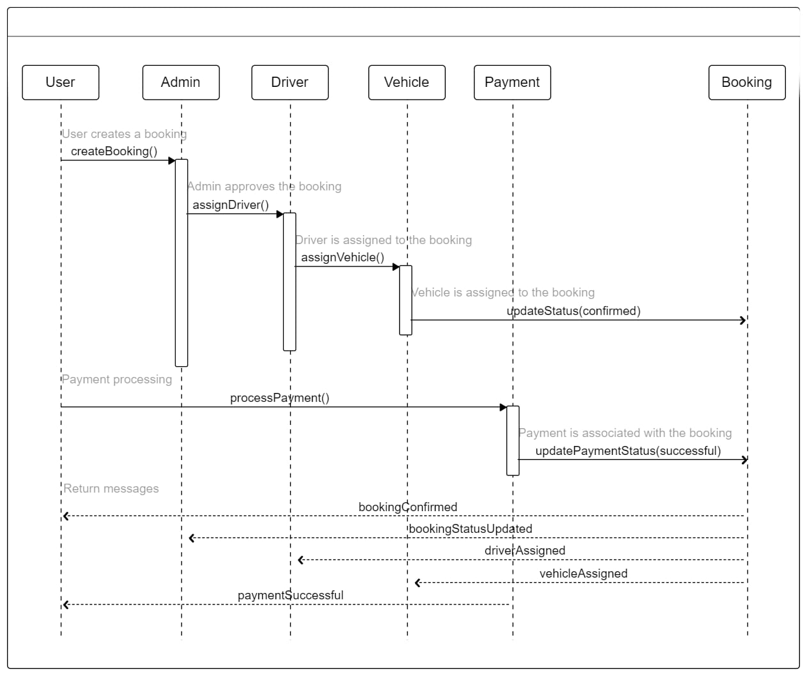
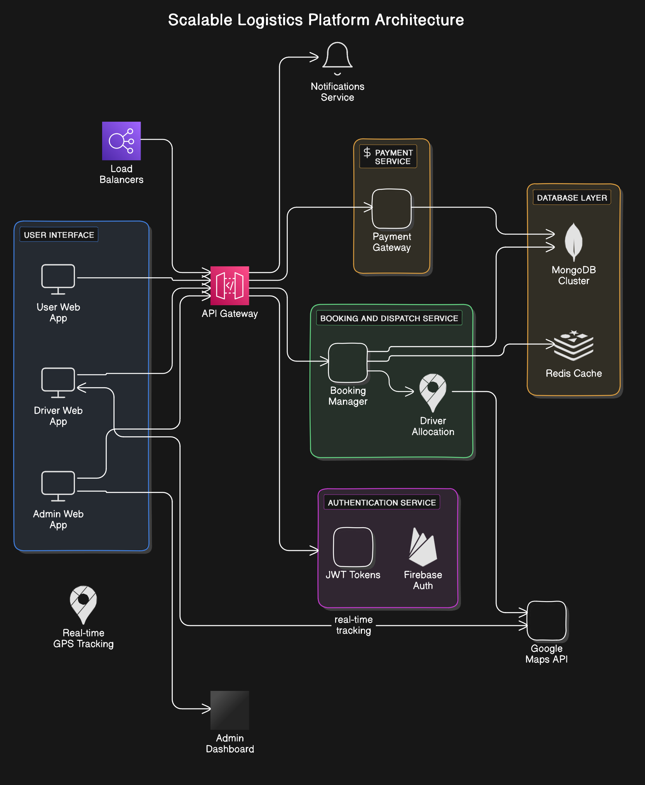
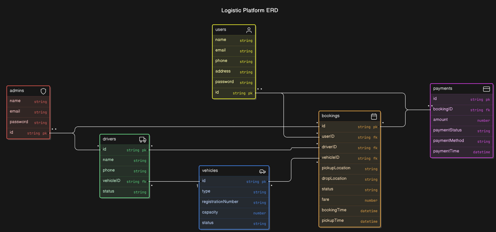

# Logistics Platform

## Objective
The project aims to provide a highly scalable logistics platform similar to Uber India, with features like real-time vehicle tracking, driver allocation, dynamic pricing, and multi-role dashboards for users, drivers, and admins. The platform supports two-wheelers, mini trucks, and trucks, making it adaptable for various delivery needs.

## Introduction
This platform is designed to solve the challenges of managing vehicle logistics for deliveries. It includes dynamic pricing models with surge charges during peak hours, bad weather, and remote or crowded areas. Real-time GPS tracking ensures customers can monitor their deliveries, while drivers receive bookings based on proximity.

The system uses sharding, caching, and load balancing to handle high traffic and ensure performance at scale.

## Features

- **Real-Time Vehicle Tracking**: Uses Google Maps API to provide live tracking of deliveries.
- **Dynamic Pricing**: Implements a surge pricing model based on time, location, weather, and demand.
- **Role-Based Dashboards**:
  - **User Dashboard**: Book services, track deliveries, and view history.
  - **Driver Dashboard**: Accept and manage jobs, update status in real-time.
  - **Admin Dashboard**: Manage drivers, vehicles, and view analytics.
- **Driver Allocation**: The platform dynamically assigns drivers based on proximity to the user's pickup location.
- **Analytics & Performance Monitoring**: Admin can view driver performance and job completion rates.
- **Scalability**: With MongoDB sharding and Redis caching, the platform supports thousands of concurrent users and drivers.

## Technology Stack

- **Frontend**:
  - **React.js**: For building the user interface.
  - **Firebase**: For user, driver, and admin authentication.
  - **Google Maps API**: For vehicle tracking and proximity-based driver assignment.
  
- **Backend**:
  - **Node.js**: For server-side processing.
  - **Express.js**: For handling routes and middleware.
  - **MongoDB (with Sharding)**: To store user, driver, and booking data, ensuring horizontal scaling.
  - **Redis**: For caching frequently accessed data like live vehicle positions to improve performance.
  
## Why These Technologies?

- **MongoDB (Sharding)**: To manage large datasets, we adopted MongoDB's sharding feature. It allows the database to scale horizontally by distributing data across multiple servers. This ensures that the system can handle the high volume of bookings and real-time tracking data, similar to the way Uber India operates its massive fleet management system.
  
- **Google Maps API**: Provides real-time vehicle tracking and ensures accurate driver allocation within a 10km radius of the pickup location using proximity-based algorithms.
  
- **Redis Caching**: Reduces the load on the main database by caching commonly accessed data, ensuring fast response times during high traffic.

## High-Level Architecture Diagram

In the high-level architecture, load balancers ensure even distribution of traffic, Redis caching stores frequently accessed data like GPS locations, and MongoDB sharding supports the system’s horizontal scaling. The application is designed to handle large amounts of real-time data, with sharding and caching to improve response times.

## Entity-Relationship (ER) Diagram

The ER diagram showcases the relationships between key entities such as Users, Drivers, Bookings, Vehicles, and Admins. Each user can create multiple bookings, each booking is assigned a driver and vehicle, and the admin manages the overall system.

## Major Design Decisions and Trade-offs

- **Scalability**: MongoDB’s sharding ensures the system can scale to handle a large number of bookings and vehicles.
- **Real-Time Data Handling**: Google Maps API integration is crucial for real-time tracking, with Redis ensuring that frequently accessed data (like vehicle positions) is quickly retrievable.
- **Load Balancing**: NGINX and load balancers distribute the user requests across multiple servers, ensuring even traffic distribution.

## Managing High-Volume Traffic

The combination of MongoDB sharding and Redis caching allows the system to handle a high volume of traffic. By offloading frequently accessed data into Redis, the system reduces direct database calls, improving performance. MongoDB shards divide the data into smaller, more manageable collections that can be distributed across different servers.

## Load Balancing and Distributed Data Handling

By implementing NGINX for load balancing and MongoDB sharding for distributed data storage, the system can scale horizontally and handle the dynamic load of thousands of users. Redis caches data like GPS locations for quick access, while MongoDB shards handle large amounts of structured data like bookings and user information.
